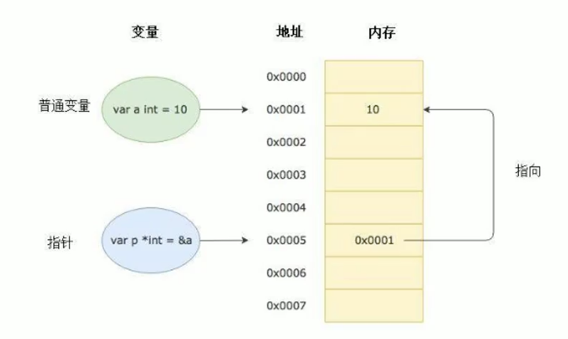

## 指针概念

- 指针也是一个 `变量`，但它是一种特殊的变量

- 指针变量就是存储了另一个变量的内存地址，使得程序可以通过这个地址来访问或者操作那个特定的变量

- 因为指针也是一个 `变量`，所以指针不仅存储了另一个变量的内存地址，自己也有一个特定的内存地址



## 指针定义

```go
var 指针变量名 *类型
```

## 通过指针间接修改变量的值
```go
var p *int
p = &a
*p = 222
```

## 数组指针

- 数组指针是一个指针，它指向一个数组

```go
var 数组指针变量 *[长度]类型
```

## 指针数组

- 指针数组指的是一个数组中存储的都是指针（也就是地址）
- 也就是存储了地址的数组

```go
var 数组名 [长度]*类型
```