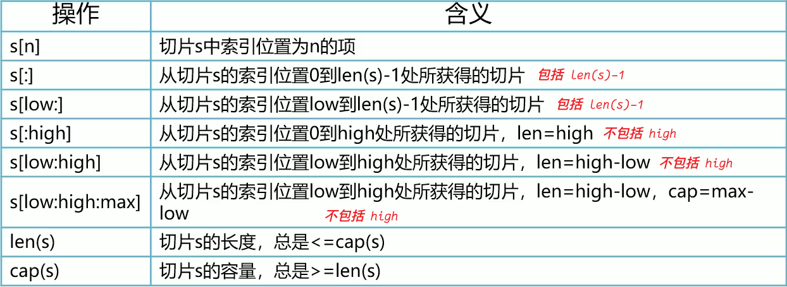

## 切片概念

- 切片与数组相比，切片的长度不是固定的，可以追加元素，在追加时可使切片的容量增大

- 可以将切片理解成“动态数组”，但是它却不是数组，通常情况下切片的使用更为广泛

## 切片创建

- var 切片名 []数据类型

- 切片名 := []类型{}

- 使用 make() 函数创建
    - make(切片类型, 长度, 容量)
    - `长度`是指已经初始化的空间
    - `容量`是指已经开辟的空间，包括`已经初始化的空间`和`空闲的空间`
    - 其中`长度不能大于容量`

## 切片截取

- 所谓切片截取就是从切片中获取指定的数据

- `low`、`high` 和 `max` 必须是非负整数

- `low` 和 `high` 必须在原切片的索引范围内，即 `0 <= low <= high <= len(slice)`

- `max` 的值必须在原切片的容量范围内，即 `high <= max <= cap(slice)`

- 切片截取后返回新切片，对新切片的值进行修改，会影响原切片

## 切片扩容

- 一般扩容方式为`上一次的容量 * 2`

- 如果`超过 1024 byte`，每次扩容`上一次的 1/4`